# Plaque Size Tool User Manual

[Introduction](#Introduction)

[Prerequisites installation](#prerequisites-installation)

- [Python installation](#python-installation)

- [Pip3 installation](#pip3-installation)

[Plaque Size Tool installation](#plaque-size-tool-installation)

- [GitHub archive download](#github-archive-download)

- [Installation using pip](#installation-using-pip)

[Plaque Size Tool usage](#plaque-size-tool-usage)

- [Plaque Size Tool usage options](#plaque-size-tool-usage-options)

- [Single file processing](#single-file-processing)

- [Examples](#examples)

[Batch files processing](#batch-files-processing)

- [Example](#example)

[Output files](#output-files)

# Introduction

Plaque Size Tool is an open-source application written in Python 3 that
is able to detect and measure bacteriophage plaques on a Petri dish
image.

The source files are located at
<https://github.com/ellinium/plaque_size_tool>.

To cite Plaque Size Tool, please use [doi.org/10.1016/j.virol.2021.05.011]([doi.org/10.1016/j.virol.2021.05.011]): 
```
"Trofimova E, Jaschke PR. Plaque Size Tool: An automated plaque analysis tool for simplifying and standardising bacteriophage plaque morphology measurements. Virology. 2021;561(April):1–5. doi: 10.1016/j.virol.2021.05.011"
```

The tool can be installed on any operation system supporting Python.

The installation guide is provided for two most frequently used OS –
Windows and MacOS.

To execute installation commands on Mac use ‘Terminal’ or any other
command line interpreter (CLI) preferred, on Windows use ‘Command
Prompt’ (or any other CLI preferred).

The CLI screenshots taken for this manual were made on macOS High Sierra
and Windows 10.

Plaque size tool was tested on the Python versions 3.7, 3.8 and 3.9.4,
and if you are experiencing any problems with the higher versions,
please send an email with the error to <ellina.trofimova@hdr.mq.edu.au>
or create an issue at
<https://github.com/ellinium/plaque_size_tool/issues> (requires
registration on GitHub).

# Prerequisites installation

*Python 3.6* or higher and *pip3* should be installed on the system.

It is possible to test whether they are installed on your OS by
executing a command in Terminal (macOS) or Command Prompt (Windows):

MacOS: execute 
```
python3 --version
```

  
Windows: execute 
```
py --version
```
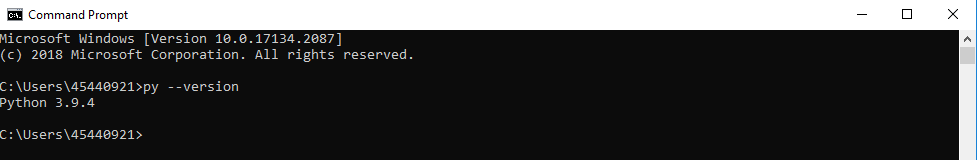

*pip3* should be installed on the system.

Pip3 is usually already installed on your system if you are using Python
3.6 or higher.

To check whether it is installed or not, execute the command ‘pip3’ in
your CLI (the same command is used both for Windows and MacOS).

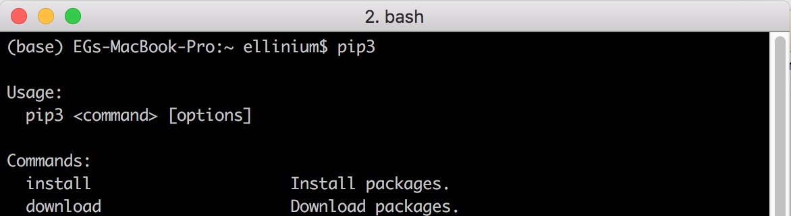

## Python installation

If Python3 is not found in your system, please navigate
to <https://www.python.org/downloads/>.

On the main page there is a link to the latest version of Python3
depending on your OS.

MacOS:

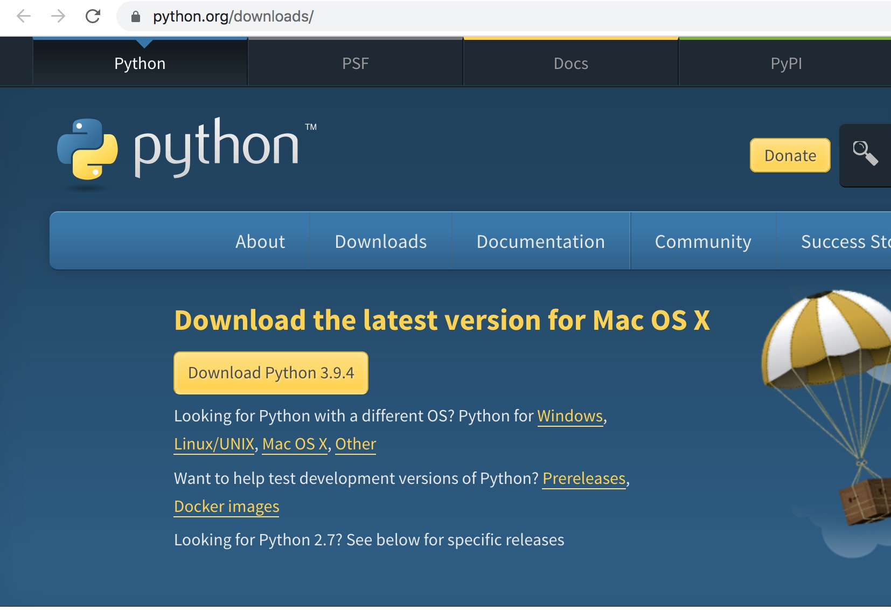

Windows:

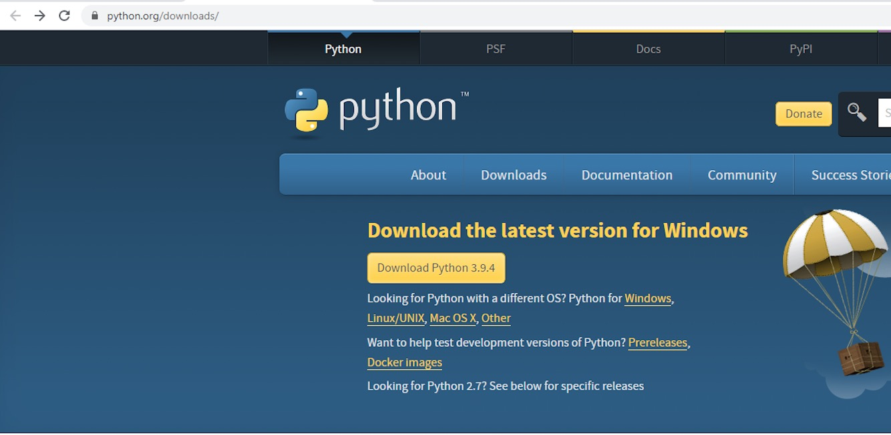

Install the latest version of Python by clicking ‘Download Python
&lt;latest version&gt;’ and running the downloaded package.

The detailed instructions for Python download and installation are also
provided at <https://wiki.python.org/moin/BeginnersGuide/Download>.

After Python installation, check that Python3 and pip3 were installed
properly by executing the same commands as above:

MacOS:
```
python3 –-version
```
```
pip3
```
Windows:
```
py –-version
```
```
pip3
```
## Pip3 installation

If Python3 is installed in your system but *pip3* is missing, it is
possible to install it separately.

For that, navigate to <https://pip.pypa.io/en/stable/installing/> and
the section **'Installing with get-pip.py'**.

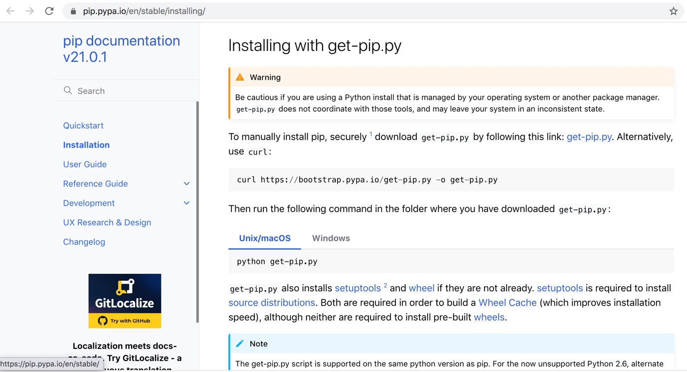

Execute the following command to download get-pip.py file:

MacOS: 
```
python3 get-pip.py
```

Windows: 
```
py get-pip.py
```
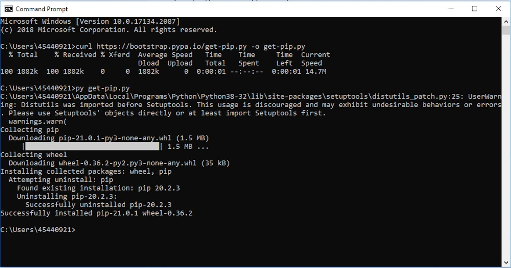

If pip3 is installed but outdated, please upgrade it by executing the
following command:

MacOS: 
```
python3 -m pip install --upgrade pip
```

Windows: 
```
py -m pip install --upgrade pip
```

# Plaque Size Tool installation

## GitHub archive download

Navigate to <https://github.com/ellinium/plaque_size_tool>. After that,
click the green button 'Code' in the right corner and select the option
'Download Zip'.

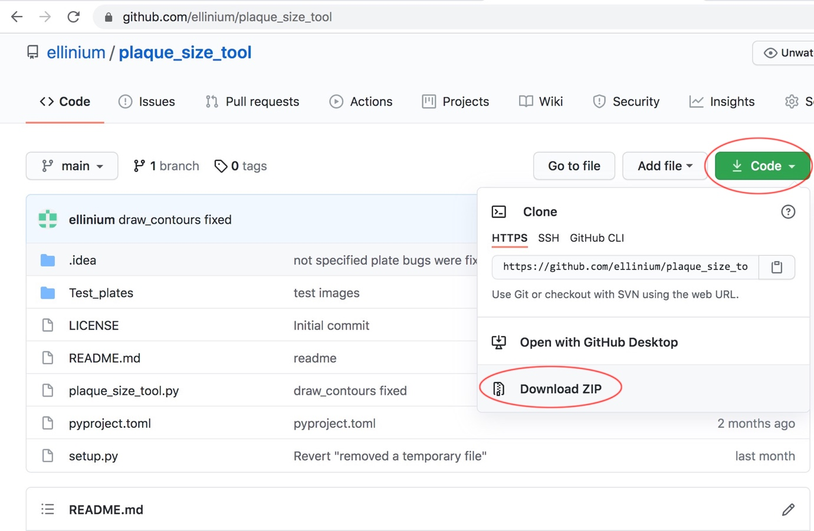

The archive called ‘plaque\_size\_tool-main.zip’ will be downloaded.
Unpack the archive into the directory of your choice.

&lt; OPTIONAL &gt;: If you have already installed the program git,
another option to download the files is to use the command:
```
git clone https://github.com/ellinium/plaque_size_tool directory
```
, where directory is a directory for Plaque Size Tool
on a local machine.

## Installation using pip

Next, within Terminal (macOS) or Command Prompt (Windows) navigate to
the directory you unpacked the downloaded zip file into. For example, if
you unpacked ‘plaque\_size\_tool-main.zip‘ into the
‘/home/plaque\_size\_tool/ plaque\_size\_tool-main’ directory, navigate
to this directory. To confirm you are in the directory containing the
plaque size tool files, type ‘ls’ on Terminal (MacOS) or ‘dir’ on
Command Prompt (Windows). You should see the following files listed:

Test\_plates
LICENSE
plaque\_size\_tool.py
pyproject.toml
README.md
setup.py

Once in the directory containing plaque size tool, execute the following
command which installs all required libraries for Plaque Size Tool:

```
pip3 install plaque-size-tool
```

If the pip3 command worked properly you should see something like this
on your screen:

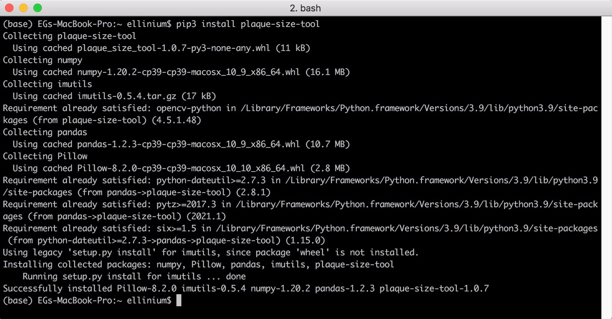

MacOS and Windows use the same command for installation.

# Plaque Size Tool usage

## Plaque Size Tool usage options

The tool can be run on a single image file (TIF, TIFF, JPG, JPEG, PNG
image formats are supported) or on a directory containing several image
files. The output of Plaque Size Tool will be placed into a
sub-directory called ‘out’ within the /plaque\_size\_tool-main
directory.

You can execute the command to run Plaque Size Tool from the directory
used in **Installation Step 3.1.** If your current directory differs,
you need to include a full path to the tool (see below for examples).

***Input parameters:***

-i to process a single image file

-d to process a directory with image files

-p is an optional parameter for the Petri dish size in millimetres

-small an optional flag, is recommended to use when the plaques are less
than 2.5 mm or images are of low resolution and size

## 
 
## Single File processing

MacOS: 

```
python3 PATH_TO_PST/plaque_size_tool.py -i PATH_TO_THE_IMAGE_FILE [-p plate_size] [-small]
```
Windows: 
```
py PATH_TO_PST/plaque_size_tool.py -i PATH_TO_THE_IMAGE_FILE [-p plate_size] [-small]
```
When the tool is executed from the directory Plaque Size Tool is
installed into, the PATH_TO_PST can be omitted:

MacOS: 
```
python3 plaque_size_tool.py -i PATH_TO_THE_IMAGE_FILE [-p plate_size] [-small]
```

Windows: 
```
py plaque_size_tool.py -i PATH_TO_THE_IMAGE_FILE [-p plate_size] [-small]
```

### Examples

<u>To use the following examples on Windows **‘python3’** is required to
be replaced with **‘py’**.</u>

MacOS: 
```
python3 plaque_size_tool.py -i Test_plates/large/Plate_4.tif
```
• runs the tool on the file Plate_4.tif located in the sub-directory
Test_plates/large

• creates two files within the /out directory called:
‘data-green-Plate\_4.csv’ and ‘out\_Plate\_4.tif’

• all results within ‘data-green-Plate\_4.csv’ will be shown in pixels
as the plate size is not specified.

MacOS: 
```
python3 plaque_size_tool.py -i Test_plates/large/Plate_4.tif -p 90
```
• runs the tool on the file Plate\_4.tif that has a plate size 90 mm.

• the results file ‘data-green-Plate\_4.csv’ will contain measurements
in both mm and pixels.

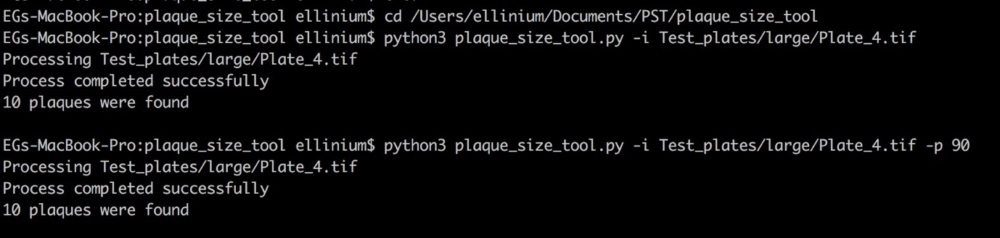

MacOS: 
```
python3 plaque_size_tool.py -i Test_plates/small/Plate_16.tif -p 90 -small
```

• runs the tool on the file Plate\_16.tif that has small plaques. The
results on a plate will be shown in mm.

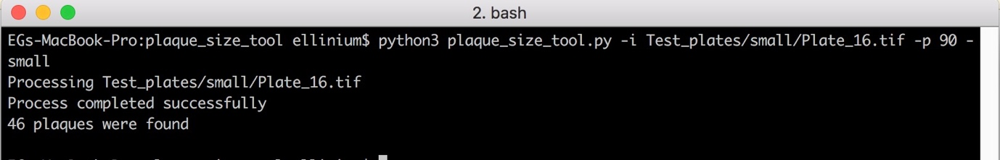

## 

• If executing the tool while the current working directory (which can
be checked with command ‘pwd’ on MacOS, ‘cd’ on Windows) is not
‘/plaque\_size\_tool-main’ then the full path to the
‘plaque\_size\_tool.py’ file AND the image file must be specified, or an
error will be shown because python3 cannot find the executable file and
image file.

MacOS: 
```
python3 /Users/paul/plaque_size_tool-main/plaque_size_tool.py -i /Users/paul/plaque_size_tool-main/Test_plates/large/Plate_4.tif
```
## Batch files processing

MacOS: 
```
python3 PATH_TO_PST/plaque_size_tool.py -d PATH_TO_THE_DIRECTORY [-p plate_size] [-small]
```
Windows: 
```
py PATH_TO_PST/plaque_size_tool.py -d PATH_TO_THE_DIRECTORY [-p plate_size] [-small]
```
### Example

MacOS: 
```
python3 plaque_size_tool.py -d Test_plates/small -p 90 -small
```
Windows: 
```
Windows: py plaque_size_tool.py -d Test_plates/small -p 90 -small
```
• runs the tool on the directory Test\_plates/small that contains plates
with small plaques (&lt;= 2.5 mm). The results on a plate will be shown
in mm.

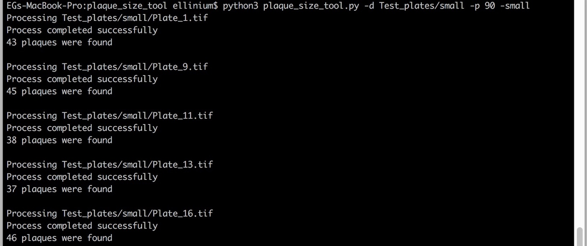

## Output files

The tool produces two output files in the ‘out’ sub-directory that is
created automatically:

**out\_&lt;file\_name&gt;** - an image with identified non-overlapping
plaques circled with a green line, where &lt;file\_name&gt; is the name
of the original file.

> If -p (plate size) parameter is specified, the results will be shown
> in mm. If -p is not specified, then the results are shown in pixels.

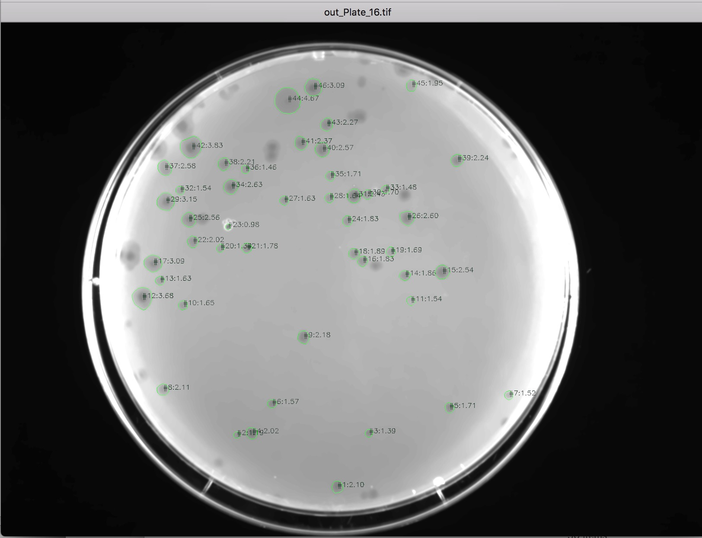


**data-green-&lt;file\_name&gt;.csv** a CSV file with detected plaques
parameters:

> INDEX\_COL - the ID of the plaque that corresponds to the ID on the
> output image
>
> AREA\_PXL - Area of a plaque in square pixels
>
> AREA\_MM2 - Area of a plaque in square millimetres if plate size is
> specified
>
> DIAMETER\_PXL - Diameter of a plaque in pixels
>
> DIAMETER\_MM - Diameter of a plaque in millimetres if plate size is
> specified

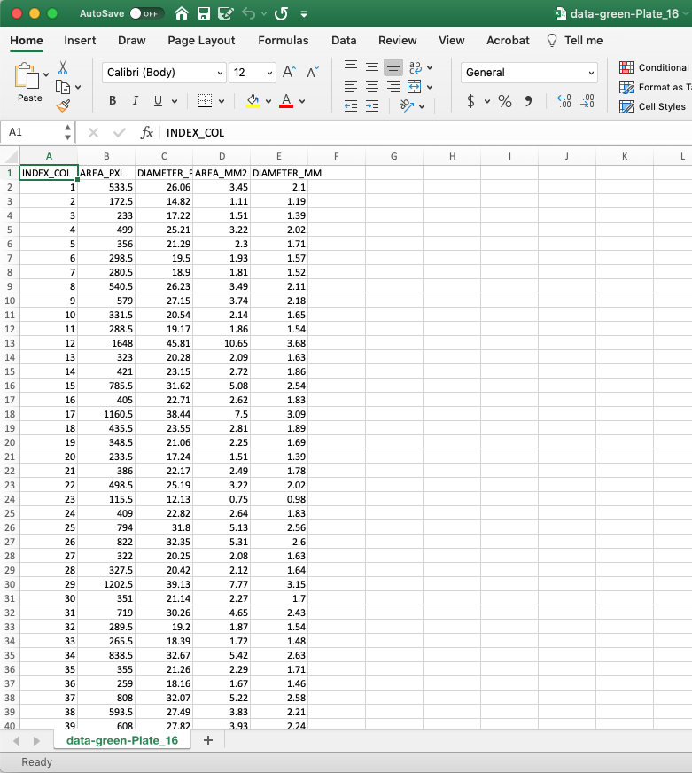
